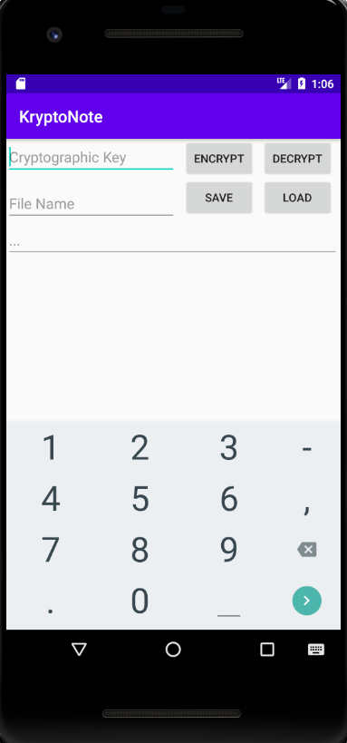
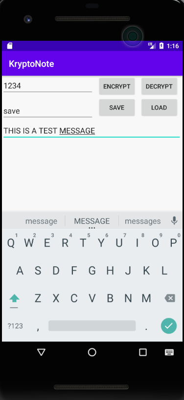
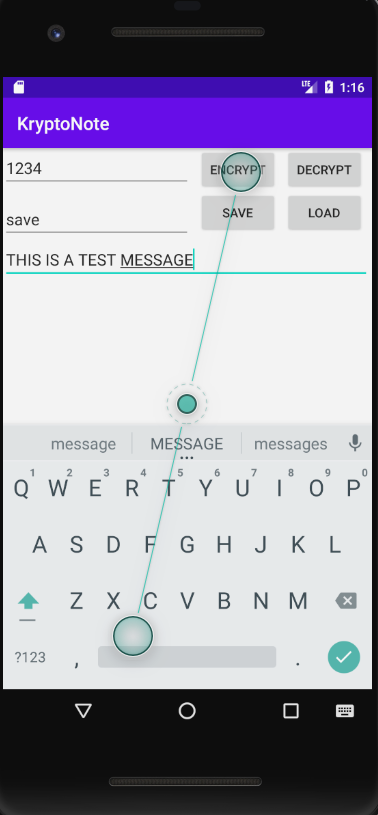
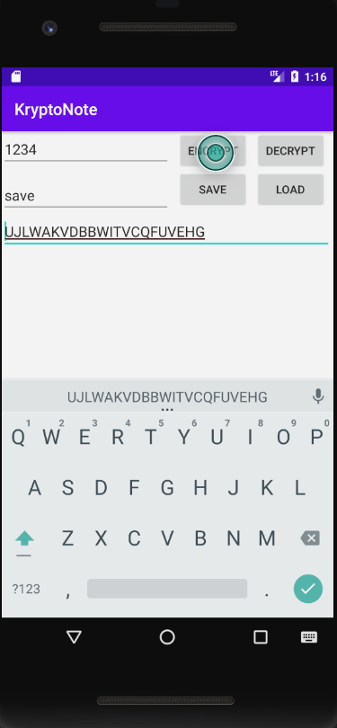
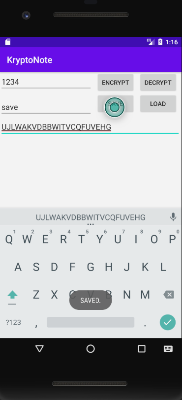
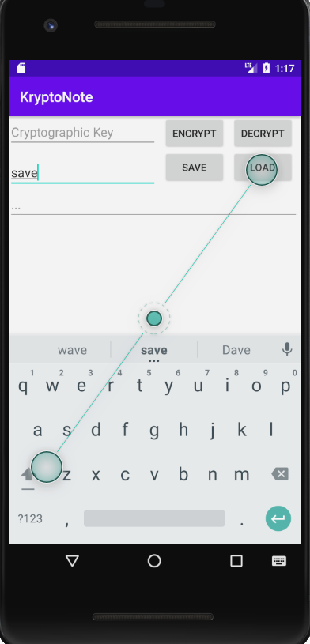
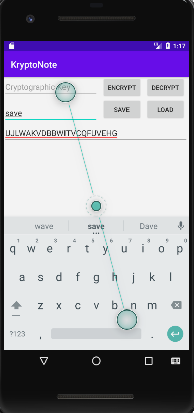
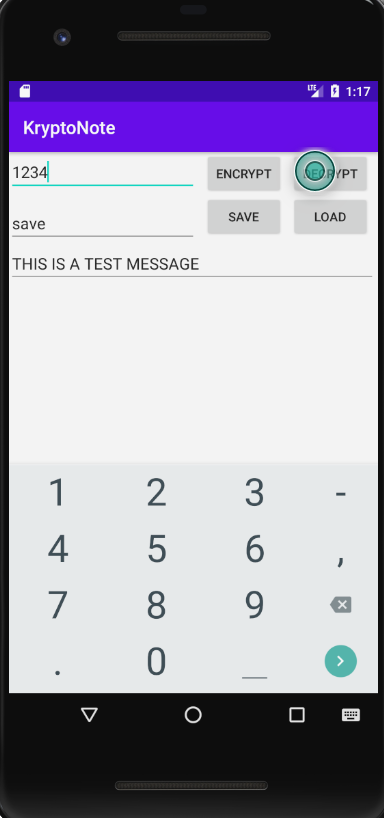

#  KryptoNote 
As I have officially passed my EECS 1022 course in Fall 2020 semester , I would like to share an app that I made as a Lab on Android Studio using 
"@Introduction to Computer Science with Andriod Studio- by Hamza Roumani"

App Name : KryptoNote 

--- 

## About KryptoNote
It is a android studio java based cipher app which allows you to encrypt a message using a Key and allows you to save your message in your local file. 
Using the file and Key the recepient can decrypt the message. It uses Vigenere Cipher.

## Vigenere Ciphere
Algorithm used to encrypt the message : 
Input is the : *Message*
and
Key : *Numeric* 
The encryption process starts with creating a *pad* which has the same length as that of the message contructed using inputted key in a circular loop.

> Code for creating a pad
```private String makePad(String note) {
        String pad = this.key;     
        for ( ; pad.length() < note.length(); pad += this.key) ;
        return pad;
    }
```
Then after creating pad , The words are adjusted using a templated Alphabet Sequence : ```public static final String ALPHABET = " ABCDEFGHIJKLMNOPQRSTUVWXYZ";```
and added indentified its spot and adjused to next number using from ad and alphabet. 
> Code for encryption 
```  
    public String Encrypt ( String note){
        String pad= makePad(note) ;
        String result="" ;

         for ( int i = 0 ; i< note.length() ; i++){
            String c= note.substring(i,i+1);
              int position =ALPHABET.indexOf(c);
                int shift=Integer.parseInt(pad.substring(i,i+1)) ;     
                    int newPosition= (position + shift)%ALPHABET.length() ;
                        result+= ALPHABET.substring(newPosition,newPosition+1) ;
                       }
         return result ;
         
```

## First Look : 


## Adding a Message and Key


## Click Encrypt after entering the key and message.


## The message in the input box is the coded message 


## The coded message can be saved to local file and can be sent to your girlfriend's family email(lol!) 

## Since your girlfriend already has this app installed and file (downloaded from email ) she can load the message 

## And I'm sure use must have given her the Key to decode at school (hypothecial situation) (Do kill me in comments if you dont find it funny)

## Hit Decrypt and  *There is your coded message* 



